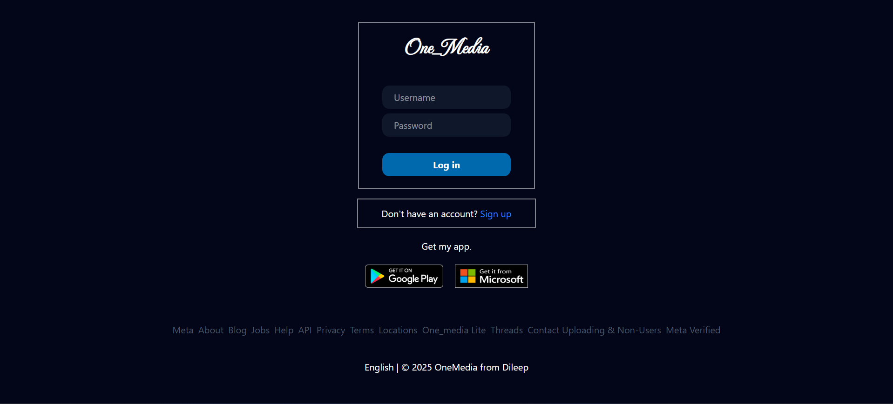
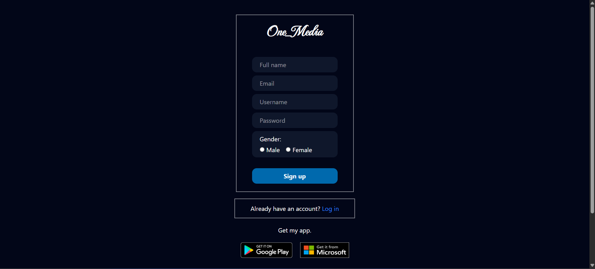
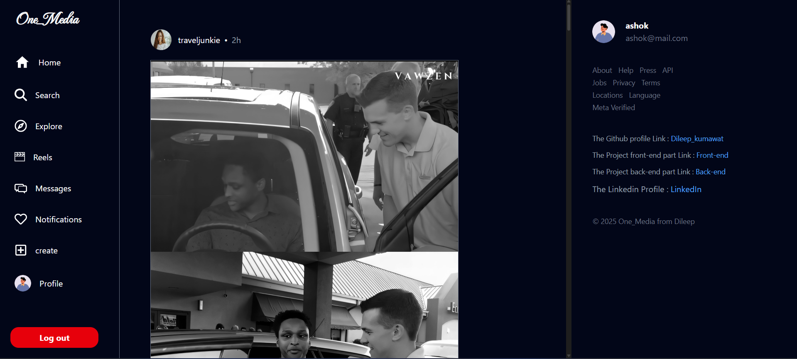

````markdown
# 🌍 One Media – Social Media Concept (Unfinished Project)

  
*(Replace `thumbnail.png` with your actual thumbnail file name if available)*

**One Media** is an experimental social media web app that brings together the **best features of all major platforms** into a single place.  
Although this project is currently incomplete, it represents an important step in my journey of learning the **MERN Stack** and **Tailwind CSS**.

---

## 📸 Screenshots & Demo
-   
-   
-   
- 🎥 [Demo Video](./demo.mp4)  

---

## 🚀 Features (Planned & Partially Implemented)
- 📢 **Feed system** (like Facebook/Twitter)  
- 🎥 **Reels/short video support** (like Instagram/TikTok)  
- 💬 **Messaging system** for chatting  
- 📍 **Live location sharing**  
- 👤 **Profile handler** with editable details  
- 📊 **User dashboard** for profile overview  

---

## 🛠️ Tech Stack
- **MongoDB** – Database  
- **Express.js** – Backend framework  
- **React.js** – Frontend library  
- **Node.js** – Runtime environment  
- **Tailwind CSS** – Styling  

---

## 📖 What I Learned

* Setting up a **MERN stack project**
* Structuring **frontend & backend code**
* Integrating **Tailwind CSS** for UI
* Handling **basic routes and APIs**
* Managing a **multi-feature project idea**

---

## 📌 Why I Stopped

I paused this project because I realized I needed to:

* Strengthen my **core skills in MERN & React**
* Learn better **project structure & scaling**
* Master concepts like **authentication, security, and performance**

This experience motivated me to **learn deeper first, then rebuild a better version** of One Media in the future.

---

## 🔮 Future Plans

* Rebuild **One Media 2.0** with cleaner code
* Add **authentication (JWT/OAuth)**
* Improve **real-time chat (Socket.IO)**
* Deploy live version for public demo

---

## 🙌 Acknowledgements

This project is unfinished but marks an **important milestone in my learning journey**.
It reminds me that **big ideas need strong foundations**—and I’m now working on building those foundations. 💪

---

⭐ If you’re reading this, feel free to follow my journey as I continue to grow as a developer.

```